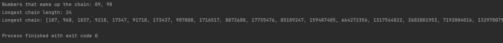
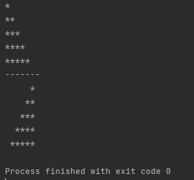
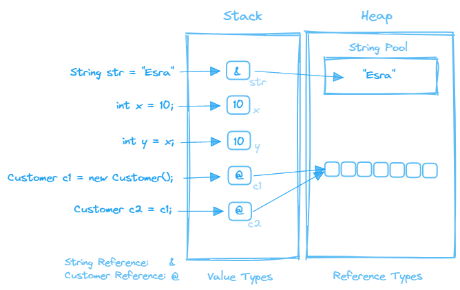
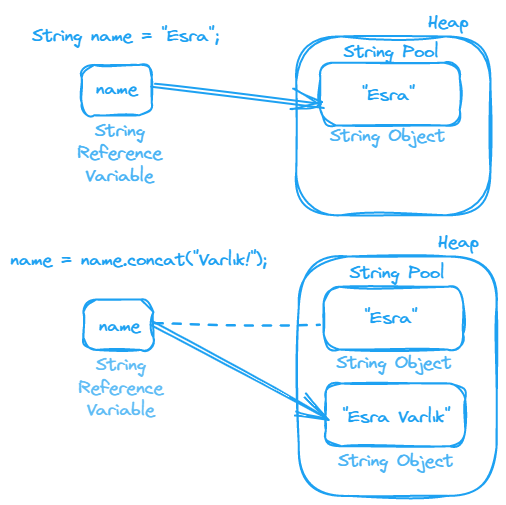
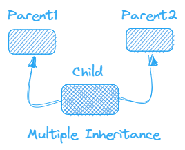
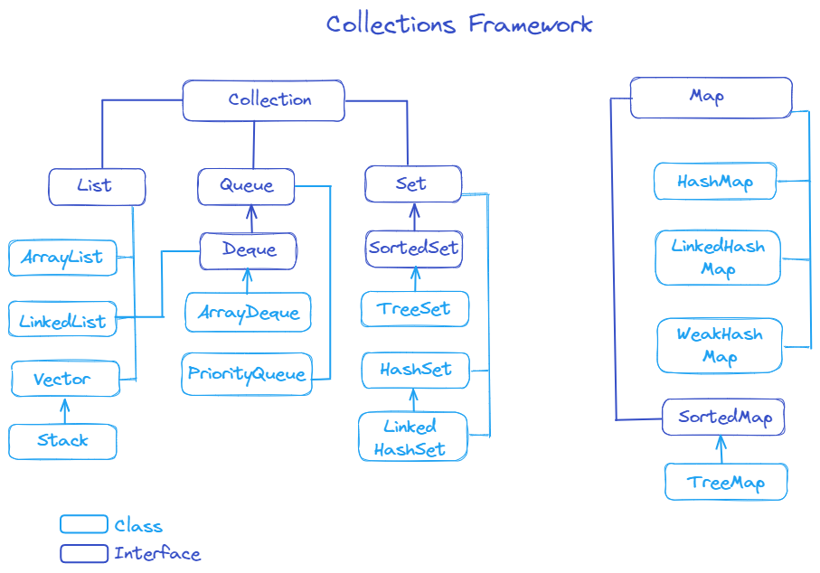
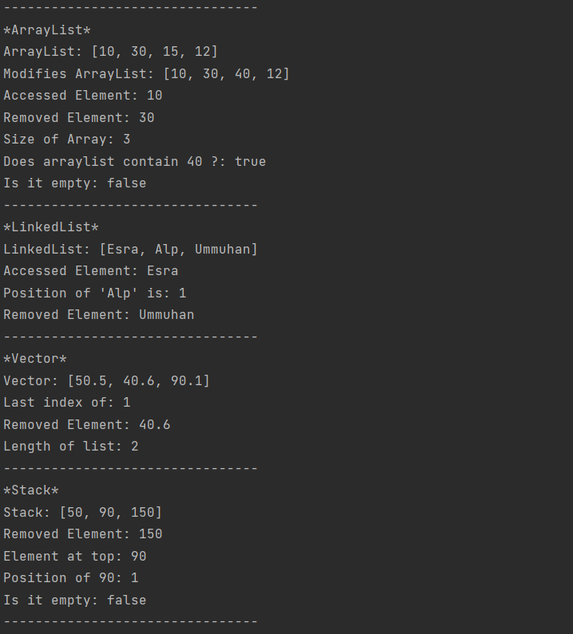
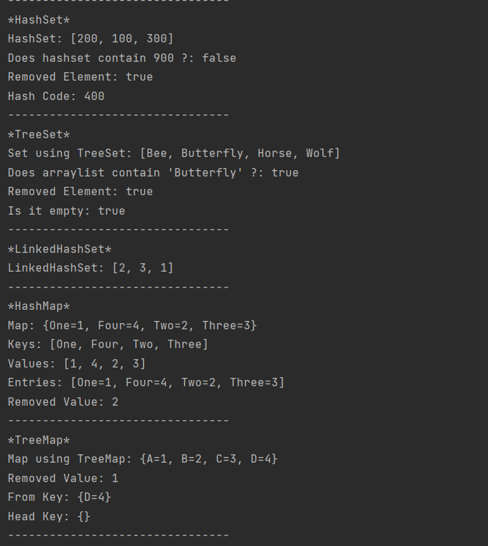
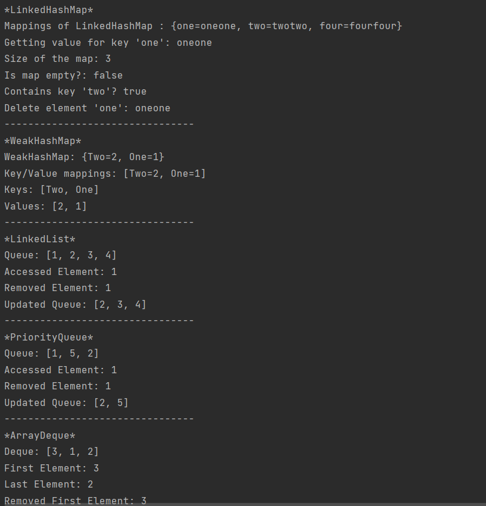
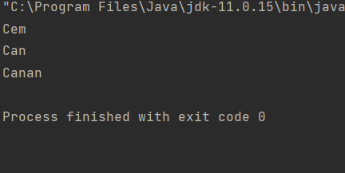

**1. Palindrome Chain**  
**Output;**  
  

**2. Star Row**  
**Output;**  
  

**3. Java’nın platform bağımsızlığını nasıl sağladığını anlatınız.**  

Platformdan bağımsız, sistemin işletim sisteminden bağımsız 
olduğu anlamına gelir. Bu durum bytecode oluşturulması ile sağlanır. 
Ara aşama yani byte code'ın oluşturulması java platformunu bağımsız kılar.  
C/C++ dillerinde kod .exe dosyası olarak oluşturulur. Oluşturulan bu .exe 
dosyası yalnızca belirli bir işletim sisteminde çalışabilir. Yani program 
Windows işletim sisteminde derlendiğinde .exe dosyası Unix işletim sisteminde 
değil, yalnızca Windows işletim sisteminde çalışabilir.  
Java'da ise her sistemin, JDK yazılımı kurulduğunda otomatik olarak kurulan 
kendi JVM'mi (Java Virtual Machine) vardır. JVM, bilgisayarınızın bir Java
programını çalıştırmasını sağlayan soyut bir makinedir.

  
Oluşturulan .java uzantılı dosyalar, derleyici tarafından derlendikten sonra .class
uzantılı hale getirilir. Yani byte code’a dönüştürülür. JVM’de bu byte code’ları
çalıştırır. JVM, bayt kodunu yerel makine koduna çevirir. Her işletim sisteminin, 
.class dosyasını veya bayt kodunu okuyabilen ayrı JVM'i mevcuttur. JVM C++ ile yazılmıştır.
JVM platforma bağımlıdır bu sayede Java **“Platformdan Bağımsız”** dır.  


**4. Java’da heap ve stack kavramlarını örneklerle açıklayın.**  

Stack ve Heap RAM'de bulunan mantıksal yapılardır. Java'da veri tipleri **primitive types** (int, long,...) 
**reference types** (String, Class,...) olmak üzere ikiye ayrılır. Primitive typelar stack de tutulurken, 
reference typelar heap de tutulur.  

Stack de tutulan verilerin runtime'dan önce değerlerinin ve buna bağlı olarak veri 
büyüklüğünün bilinmesi gerekir. Yani **statik** değişkenler tutulur. Bu belleğe erişim, 
LIFO sırasına göre yapılır. Ne zaman yeni bir method çağırsak, stackin üstünde, primitive
variable ve nesnelere ait referanslar gibi o yönteme özgü değerleri içeren yeni bir
blok oluşturulur. Yani her thread için ayrı bir stack oluşturulur ve o thread o stack’i kullanır. 
Thread tamamlandığında stack otomatik olarak kapanır.
Bu bellek doluysa java.lang.StackOverFlowError hatası ile karşılaşılır.  

Reference typlerin ise referansları stack de değerleri ise heap de saklanır. Heap alanındaki referans 
değeri stack alanındaki bir pointer ile tutulmaktadır. Veri büyüklüğü **dinamik** olarak değişir. 
Veriler karışık bir şekilde saklanır. Bu nedenle heap de ki bir veriye erişmek stack de ki bir veriye 
erişime göre daha yavaştır. Yığın alanı doluysa Java, java.lang.OutOfMemoryError hatası verir.

  
``` java
Customer c1 = new Customer();
Customer c2 = c1;  
```
New anahtar sözcüğü kullandığınızda, JVM, nesne için bir instance oluşturur. Çalışan
her JVM için yalnızca bir heap vardır. Yukarıdaki kod satırı, Customer classından 
iki nesne oluşturur. Nesnenin referansı stack de nesne ise heap de tutulur. Fakat heap 
alanında bir obje oluşturulduğunda yani c1 ve daha sonradan aynı değere sahip farklı bir obje oluşturulduğunda 
yani c2, heap alanında zaten böyle bir nesne olduğundan c2 nesnesinin typenı bu nesneye
referans eder. Bu yüzden  c1 referans typda yapılan değişiklik örneğin copy diğer referans
tipide etkilemiş olur. Çünkü bellek adresleri aynıdır. Heap’te tutulan değerler, kendisine işaret eden herhangi
bir referans değişkeni kalmadığında Garbage Collector tarafından temizlenir.

``` java
int x = 10;
int y = x;
```

Yukarıdaki kod satırında ise x isimli primitive bir değişken tanımlanıp, 10 değeri atanır. 
Veri tipi int olarak tanımlandığından bellekte ayrılan yerde tanımlanmış olur. 
Bu değer stack'e eklenir y isimli başka bir değişken tanımlanır. Stack de oluşturulan bir 
değişkene değer atıldığında yani ``x = 10`` ve sonradan aynı değer stack de bulunan farklı bir
değişkene atıldığında ``y = x`` dinamik oluşamayacağı için birbirinde habersiz iki farklı değişken 
mantığında çalışır. Farklı bir scope'a geçildiğinde bu method içindeki değişkenler stack den çıkarılacaktır.


**5. String class’ı nasıl immutable olmayı sağlamaktadır örnek ve çizimlerle açıklayınız.**  
  
Javada String veri tipi bir referans tiptir. Aynı zamanda immutable yani bir kez oluşturulduktan 
sonra içeriği değiştirilemeyen bir tiptir. JVMde, tüm Stringleri bellek içinde depolamak
için bir string pool yer alır. Yukardaki örnekte görüldüğü gibi bir String değişken tanımlayalım ve
ona değer atayalım: ``Esra`` Ardından aynı değişkene ``Varlık`` değerini ekleyelim. İkinci şekilde görüldüğü
gibi nesnenin referansı değişmektedir. Bu string type'ın immutable olduğunu gösterir. Yani değer değişmez.
Yeni bir obje oluşturup bir önceki objeyi garbage collector'a bırakmış olur.

Burada temel fayda önbelleğe alma, güvenlik, senkronizasyon ve performansdır.
Ağ bağlantılarında, veritabanı URL'lerinde, kullanıcı adı ve şifrelerde vb. String parametreleri kullanılır.
String değişmez olduğu için bu değerler değiştirilemez. Stringin hash kodu Java'da sıklıkla kullanılır. 
String değişmez olduğu için hash kodu aynı kalır, böylece önbelleğe alınabilir.


**6. Java neden çoklu kalıtımı desteklemez açıklayınız.**  
  

``` java
class Parent1{
    public void run(){
        System.out.println("Hello from Parent1 class");
    }
}

class Parent2{
    public void run(){
        System.out.println("Hello from Parent2 class");
    }
}

public class Child extends Parent1, Parent2{
    
}
```  

Çoklu kalıtım, bir sınıfın birden fazla parent sınıfı olduğunda gerçekleşir.
Aynı dönüş tipine ve method ismine sahip run() adında bir metoda sahip 2 parent
sınıf oluşturalım ve bir child sınıfın bu 2 sınıfı extends ettiğini varsayalım,
her iki parent de aynı olan bu run() metodunu çağırdığında, hangi üst sınıf methodun 
yürütüleceği bilinemez bu da belirsiz bir duruma yol açar, buna Diamond Problem denir.  
Çoklu kalıtım karmaşıklığı artırır, Java'da birden fazla sınıf extends edilirse
**Compile Time Error** alınır. Bu Java dilinin dizayn aşamasında verilen bir karardır.
Çok kullanılmaması ve yanlış sonuçlara yol açabilmesi nedeniyle tercih edilmemiştir.


**7. Build Tool nedir? Java ekosistemindeki build toolar neler açıklayın?** 

Buil tool kaynak koddan yürütülebilir uygulamaların oluşturulmasını otomatikleştiren bir araçtır.
Proje geliştirilirken projeyi basitleştiren ve proje bağımlılıklarının(dependency) kontrolünü yapmayı 
sağlayan bir araçtır. Build toollar yokken geliştiriciler projelerine başka bir framework ya da 
kütüphaneyi eklemek istediğinde o projenin sitesinden JAR dosyalarını indirip kendi projelerine ekliyorlardı.
Örneğin; projeye Hibernate eklemek istiyorsanız Hibernate sitesine girip JAR dosyalarını indirip
projeye eklemeniz gerekiyordu. (JAR, aynı zip gibi çalışan ancak içerisinde genellikle
derlenmiş Java classları ve kütüphane ek dosyalarını barındıran arşiv formatıdır.) Ancak projede kullanılan 
dependency sayısı artınca bu durum içinden çıkılmaz bir hal alır. Her eklenecek bağımlılık için JAR dosyalarını
elle eklemek geliştirici için büyük yük. İşte Build toolar burada devreye giriyor. Buil tollar tüm bunları proje 
için yapmaktadır. Ayrıca bu eklenen bağımlılıkların bağımlı olduğu başka dependencyler
varsa onları da sizin için projenize dahil etmektedir. Kodu binary koda derler. Ayrıca Binary kodu paketler.
Testleri çalıştırır. Kaynak kodunu sunuculara dağıtım için hazırlar. Bir zamanlar bu görevleri manuel olarak yürüten
geliştiriciler ve geliştirme ekipleri için zamandan ve kaynaklardan tasarruf edilmesine yardımcı olur.  
Java'da Open Source olarak kullanılan build toollar;
- Apache Mave
- Ant
- Gradle
- SBT  

Toollar istenirse birbiri ile entegre olarak çalışabilmektedir. 
Bunlardan günümüzde en çok kullanılanlar Maven ve Gradle'dır.  
**Maven;**  
Ölçeklenebilir ve genişletilebilirliği çok fazla kaynağa sahip olmayan projeler için idealdir.
Maven tüm konfigürasyonunu **POM.xml(Project Object Model)** adı verilen bir dosyadan almaktadır.
POM.xml projenin en üst dizininde yer alan proje konfigürasyon bilgilerini içeren .xml uzantılı bir dosyadır.
POM içerisinde projenizin adı, paketi, versiyon numarası, repolar, dependencyler ve daha birçok bilgiyi barındırabilir. 
Projeye bir dependency eklemek istediğinizde bu dosya içine eklenir.
Projemize MySql’i eklemek istediğinizi düşünelim. MVN repository web sitesine gidilir. İlgili dependency 
aratılır. Tüm versiyonlar listelenmiş şekilde gelir. İstediğimiz bir sürümü seçtiğimizi varsayalım.

```java 
<dependency>
    <groupId>mysql</groupId>
    <artifactId>mysql-connector-java</artifactId>
    <version>8.0.31</version>
</dependency>

```  
Bu kod satırlarını pom.xml de dependencies kısmına eklememiz yeterli. Dependency projeye dahil olmuş olur.
Bu sadece MySql için geçerli bir durum değil, bir çok şirket kullanılabilir projelerini bu şekilde yayınlamaktadır.

JDK versiyonu yapılandırma;  
JRE System Library
``` java
<properties>
..
<maven.compiler.target>1.11</maven.compiler.target>
<maven.compiler.source>1.11<maven.compiler.source>
</properties>
```

**Gradle;**  
Ant ve Maven üzerine inşa edilmiştir. Gradle multi-projectler için tasarlanmıştır. Performans söz
konusu olduğunda hızı artıran build zamanını azaltan Incremental build ve Compiler Daemon gibi özelliklere sahiptir.
Android projelerini daha iyi oluşturmak için daha fazla desteğe sahiptir. Maven'in XML tabanlı proje yapılandırmasını
kullanmak yerine, Groovy ve Kotlin programlama dillerine özgü bir dili (DSL) kullanılır.
Çok projeli yapılar düşünülerek tasarlanmıştır.
Çok sık güncelleme alır bu nedenle sürekli yeni özelliklere sahip olmaktadır.

Projemize MySql’i eklemek istediğinizi düşünelim. MVN repository web sitesine gidilir. İlgili dependency
aratılır. Tüm versiyonlar listelenmiş şekilde gelir. İstediğimiz bir sürümü seçtiğimizi varsayalım.
build.gradle dosyasına ilgili bağımlılık eklenir. Dependency projeye dahil olmuş olur.  
``` java
implementation group: 'mysql', name: 'mysql-connector-java', version: '8.0.31'
```
Bu iki build tool arasından seçim yapmak proje gereksinimlerine bağlıdır. Büyük projeler üzerinde çalışıyorsanız Gradle, Maven'dan
daha iyi ve daha hızlı sonuç verebilir. Daha küçük projelerle uğraşıyorsanız, Maven'in performansındaki fark
göz ardı edilebilir. Gradle'ın Groovy tabanlı oluşturma betiği, kolayca özelleştirmeye izin verir.
Maven, XML tabanlı komut dosyasına dependency eklemek için gereken ekstra adımlara aldırış etmezseniz, 
ihtiyaçlarınızı yeterince karşılayabilir. Maven'in topluluğu, Gradle dan daha önceye dayanır. 
Topluluk desteğinin olması ihtiyaçlarınızı daha iyi karşılayabilir.

**8. Collection framework içerisindeki bütün yapıları önemli methodlarıyla örnekleyip açıklayınız.**  
JAVA Collections çeşitli veri yapılarını ve algoritmaları uygulamak için bir dizi interface ve class sağlar.
Colleciton List, Queue ve Set'i kapsayan bir interfacedir. Map'in Collection interface'ini genişletmemesinin 
ana nedeni, Collection interfacenin add(E e) methodunun, Map interafacenin put(K, V) methodu gibi 
anahtar/değer çiftini desteklememesidir.  
Tüm collection türleri CollectionFrameworks-Problem8- projesinde örneklendirilmiştir.  
  

**List**  
List'te Collection gibi bir interfacedir. 
Arraylerde kullanmadan önce dizinin boyutunu bildirmemiz gerekir. ArrayList yeniden boyutlandırılabilir.
Arrayliste öge eklediğimizde veya ondan öge çıkardığımızda kapasitesini otomatik olarak ayarlayabilir.
Arraylist tek bir veriyi depolarken, Linkedlist veri, önceki verinin adresi ve sonraki verinin adresini depolar.
Bu nedenle yeni bir eleman eklemek ve çıkarmak Arraylist'ten daha kolaydır. ArrayList index ile sürekli veriye 
erişme ihtiyacı varsa kullanılması verimli olur.
Vektor ise her bir işlemi tek tek senkronize eder. Bir iş parçacığı bir vektöre erişirken
ve aynı zamanda başka bir iş parçacığı ona erişmeye çalıştığında, çağrılan bir istisna
ConcurrentModificationException oluşturulur.
Stack son giren ilk çıkar LIFO şeklinde saklanır ve erişilir. Yani elemanlar yığının üstüne
eklenir veya yığının üstünden çıkarılır. Push() methodu yığının üstüne eleman ekler. Pop() methodu
son elemanı çıkarır. Peek() methodu ise en üstteki elemanı döndürür. Stack yerine Deque interfaceni
implement eden ArrayDeque de kullanılabilir.  

Bazı List Inteface Methodları;
- ``add()``- Belirtilen öğeyi collection'a ekler. İstenirse indexde eklenebilir.
- ``size()``- Listenin boyutunu döndürür.
- ``remove()``- Belirtilen öğeyi listeden kaldırır.
- ``addAll()``- Belirli bir collectionın tüm öğelerini collectiona ekler.
- ``clear()``- Listenin tüm öğelerini kaldırır.
- ``get()``- Listelerdeki öğelere rastgele erişilebilir.
- ``set()``- Listenin öğelerini değiştirir.
- ``toArray()``- Bir listeyi array'e dönüştürür.
- ``sort()`` - ArrayList ögelerini sıralar.
- ```clone()``` - Aynı öğe, boyut ve kapasiteye sahip yeni bir arraylist oluşturur.

**Set**  
Listeler yinelenen öğeler içerebilir. Ancak, Set(kümeler)in yinelenen öğeleri olamaz.
Listelerdeki öğeler belirli bir sırayla saklanır. Ancak kümelerdeki öğeler, matematikteki kümeler gibi
gruplarda depolanır.
HashSet için capacity loadFactor tanımlanabilir. LinkedHashSet ögelerin ekleme sırasını korur. TreeSet ise
ise ögeleri sıralar.  

Bazı Set Inteface Methodları;
- ``add()``- Belirtilen öğeyi kümeye ekler.
- ``size()``- Kümenin boyutunu döndürür.
- ``remove()``- Belirtilen öğeyi kümedendan kaldırır.
- ``removeAll()``- İki küme arasındaki farkı hesaplamak için kullanılır.
- ``clear()``- Tüm öğeleri kümeden kaldırır.
- ``containsAll()``- Bir kümenin başka bir kümenin alt kümesi olup olmadığını kontrol etmek için kullanılır.
- ``toArray()``- Kümenin tüm elemanlarını içeren bir array döndürür.
- ``hashCode()`` - Bir karma kod değeri döndürür (kümedeki öğenin adresi).
- ``addAll()`` - İki kümenin birleşimini döndürür. Ortak değerlerden sadece bir tane döndürür.

**Queue**  
Yığından farklı olarak, kuyruk veri yapısı, kuyrukta depolanan ilk öğenin önce kaldırılacağı 
FIFO(ilk giren ilk çıkar) ilkesine göre çalışır.  

Bazı Queue Inteface Methodları;  
- ``add()`` - Belirtilen öğeyi kuyruğa ekler. Method başarılıysa true, değilse bir istisna döndürür.
- ``offer()``- Belirtilen öğeyi kuyruğa ekler. Görev başarılıysa, true, değilse false döndürür.
- ``element()``- Kuyruğun ilk elemanını döndürür. Kuyruk boşsa bir istisna atar.
- ``peek()``- Kuyruğun ilk elemanını döndürür. Kuyruk boşsa null döner.
- ``remove()``- Kuyruğun ilk elemanını döndürür ve kaldırır. Kuyruk boşsa bir istisna atar.
- ``poll()``- Kuyruğun ilk elemanını döndürür ve kaldırır. Kuyruk boşsa null döner.

Deque;  
Normal bir kuyrukta, elemanlar arkadan eklenir ve önden çıkarılır. Bununla birlikte, bir deque'de hem 
önden hem de arkadan elemanlar ekleyebilir ve kaldırılabilir.

Priority;  
Normal kuyruklardan farklı olarak, öncelik sırası öğeleri sıralı olarak alınır.
Öğeleri artan sırada almak istediğimizi varsayalım. Bu durumda öncelik sırasının başı 
en küçük eleman olacaktır. Bu eleman alındıktan sonra, bir sonraki en küçük eleman kuyruğun başı olacaktır.
Öncelik sırasının öğelerinin sıralanmayabileceğini unutmamak önemlidir. Ancak, öğeler her zaman sıralı sırada alınır.

**Map**  

HashMap; 
- Key: Bir mapteki her değeri ilişkilendirmek için kullanılan benzersiz bir anahtar
- Value: Bir mapteki keylerle ilişkilendirilen değerler  

Bazı HashMap Inteface Methodları;
- ``put(K, V)``- Bir key ve bir değeri eşleştirir. Key zaten varsa yeni değerle değiştirir.
- ``get(K)``- Parametredeki key değerine ait değeri döndürür. Key bulunamazsa geri null döner.
- ``includeKey(K)``- Belirtilen keyin olup olmadığını kontrol eder.
- ``includeValue(V)``- Belirtilen değerin olup olmadığını kontrol eder.
- ``replace(K, V)`` - Anahtarın değerini değiştirir.
- ``remove(K)`` - Anahtarın temsil ettiği değeri kaldırır.
- ``keySet()`` - Bir mapte bulunan tüm anahtarların bir kümesini döndürür.
- ``values()`` - Bir mapte bulunan tüm değerlerin bir kümesini döndürür.
- ``inputSet()`` - Bir mapte bulunan tüm anahtar/değer eşlemelerinin bir kümesini döndürür.  
**Output;**  
  
  
  
**9. MyList**  
**Output;**  
  
**10. OnlineShoppingSystem**  
**Output;**  